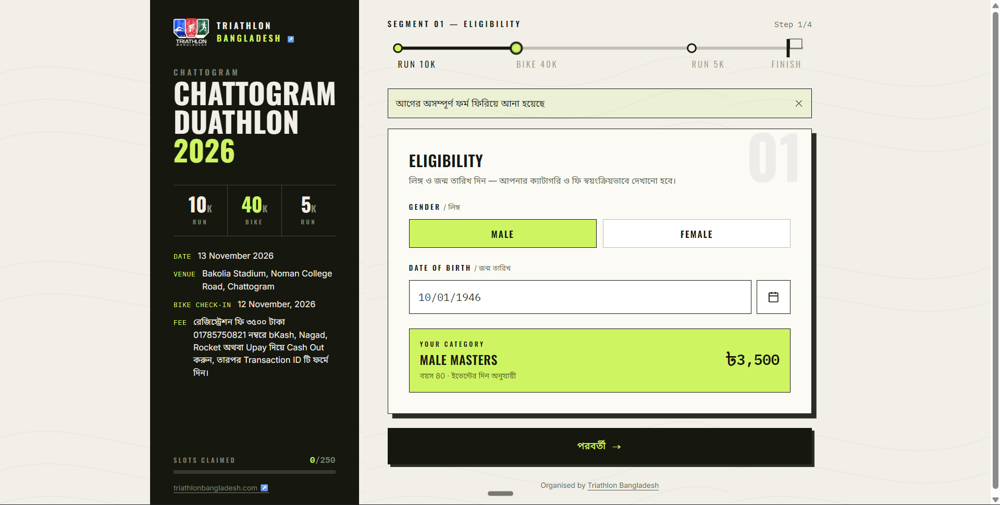
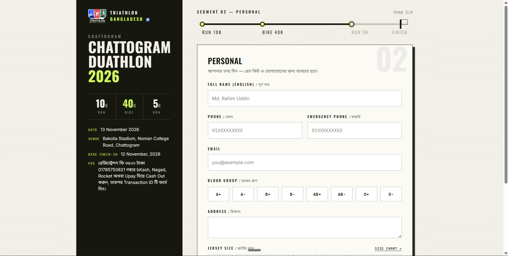
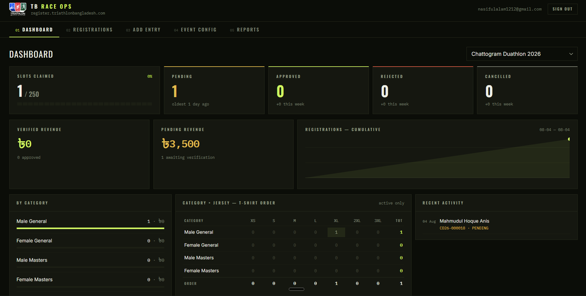
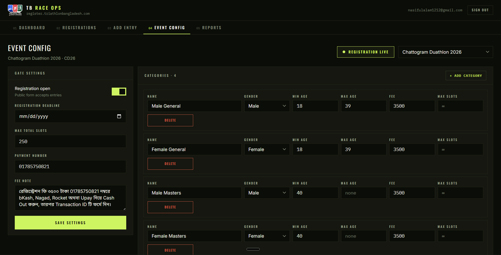

# Triathlon Bangladesh — Registration Portal

Reusable event-registration system for Triathlon Bangladesh. Built to replace an all-manual Google Form workflow with a self-serve wizard, atomic slot capacity, and an admin dashboard — without adding email/SMS or a payment gateway. v1 ships with **Chattogram Duathlon 2026** (6 Nov 2026, Bakolia Stadium, Chattogram) seeded as the first event.

**Live:** [register.triathlonbangladesh.com](https://register.triathlonbangladesh.com)

## Screenshots

| Registration wizard | Category & payment |
| --- | --- |
|  |  |

| Admin dashboard |
| --- |
|  |

| Admin Event Configuration |
| --- |
|  |

## Tech Stack

- **React 19 + TypeScript + Vite** — SPA, no SSR
- **Tailwind v4 + shadcn/ui (base-ui, not Radix)** — two visual systems in one codebase: a light "Start Line" public theme and a dark "Night Ops" admin theme
- **Supabase** — Postgres, Auth, and Row Level Security; all public writes go through a single `SECURITY DEFINER` RPC, `anon` has zero direct table access
- **SheetJS (xlsx)** — client-side Excel export for admin reports
- **react-router-dom** — routing
- No `react-hook-form`/`zod`, no email/SMS provider, no payment gateway SDK — deliberately out of scope

## Key Features

- **4-step public registration wizard** (`/register/:eventSlug`) — athlete info, category matching by age/gender, payment (bKash/Nagad/Rocket/Upay), review — with a live "bib" success screen showing the registration reference code
- **Atomic capacity control** — `pg_advisory_xact_lock`-based guards at both event and category level prevent overselling slots under concurrent submissions, without a race-prone `SELECT count(*)`
- **Admin dashboard** — status counts, revenue, per-category and per-size breakdowns, payment-method split, all animated with `CountUp`
- **Admin registrations table** — search, filter, paginate, inspect any entry in a detail drawer
- **Manual/group entry** — admins can add registrations directly (walk-ins, complimentary entries, bulk group imports) via a separate RPC that shares the same reference-code sequence
- **Event & category configuration** — toggle registration open/closed, set deadlines and slot caps, manage categories, all from the admin UI
- **Excel exports** — jersey-size pivot, timing-partner sheet, general export, all generated client-side
- **Bangla-first UX** — all user-facing copy and error messages are in Bangla; validation (phone, name, transaction ID) is mirrored client-side and server-side

## Dependencies

| Package | Purpose |
| --- | --- |
| `react`, `react-dom` | UI runtime |
| `react-router-dom` | Client-side routing |
| `@supabase/supabase-js` | Supabase client (Postgres/Auth) |
| `@base-ui/react` | Headless primitives behind shadcn's `base` library preset |
| `tailwindcss`, `@tailwindcss/vite` | Styling |
| `class-variance-authority`, `clsx`, `tailwind-merge` | Class composition utilities used by shadcn components |
| `lucide-react` | Icon set |
| `xlsx` | Client-side Excel (.xlsx) export |
| `@fontsource/inter`, `@fontsource/oswald`, `@fontsource/ibm-plex-mono`, `@fontsource/noto-sans-bengali` | Self-hosted webfonts (Bengali script support included) |
| `shadcn` | Component generator CLI (dev-time only) |
| `typescript`, `vite`, `@vitejs/plugin-react` | Build tooling |
| `oxlint` | Linting |

Full versions in [`package.json`](package.json).

## Local Setup

Project `tb-registration-portal` (ref `rmlvaalazsideynsvidg`) is already provisioned on Supabase and the schema below is already applied — steps 1-2 are only needed for a fresh environment.

1. **Create a Supabase project.**
2. **Run the schema.** In the Supabase SQL editor, paste and run the entire contents of [`supabase/schema.sql`](supabase/schema.sql). It creates the tables, RLS policies, the `register_participant` / `admin_register_participant` RPCs, and seeds the Chattogram Duathlon 2026 event (fee ৳3,500, 250 total slots, 4 categories). Re-running it is safe — the event/category rows upsert instead of erroring.
3. **Disable public signups.** In Supabase Dashboard → Authentication → Settings, turn off "Allow new users to sign up." This is what makes "any authenticated user = admin" safe — there is no public signup path anywhere in this app.
4. **Create admin users.** In Supabase Dashboard → Authentication → Users, manually add one user per admin (email + password). They log in at `/admin/login`.
5. **Configure env vars.** Copy `.env.example` to `.env.local` and fill in your project's URL and anon key:
   ```
   VITE_SUPABASE_URL=https://YOUR_PROJECT.supabase.co
   VITE_SUPABASE_ANON_KEY=YOUR_ANON_KEY
   ```
6. **Install and run locally:**
   ```
   npm install
   npm run dev
   ```
7. **Deploy to Vercel.** Import the repo, add the two `VITE_SUPABASE_*` env vars in the Vercel project settings, deploy.
8. **Point the subdomain.** In Hostinger DNS, add a CNAME for `register` pointing at the Vercel deployment, then add `register.triathlonbangladesh.com` as a custom domain in the Vercel project.

## Architecture Notes

- **The only public write path** into `registrations` is the `register_participant()` Postgres RPC (`SECURITY DEFINER`, granted to `anon`). Anon has no direct table access — no select, no insert, no update, no delete. This is enforced by RLS, not just app code.
- **Atomic capacity guards:** `register_participant()` takes `pg_advisory_xact_lock()` twice — once keyed on the event id (checked against `events.max_total_slots`, e.g. 250 for Chattogram Duathlon 2026) and once keyed on the category id (checked against `categories.max_slots`, unused for v1's categories but available per-category). Concurrent submissions serialize on these locks for the life of the transaction, so neither cap can be oversold.
- **ref_code generation** uses an atomic per-event counter (`events.reg_counter`, incremented via `UPDATE ... RETURNING` inside the same transaction) combined with the event's `short_code`, e.g. `CD26-000042`.
- **Admin manual entries** go through a second RPC, `admin_register_participant()` (granted to `authenticated` only), which reuses the same ref_code counter but skips the public-only guards (capacity, phone dedupe) since admins are trusted and can see slot counts on the dashboard.
- **Validation mirrored client + server side:** Bangladeshi phone normalization (`^01[3-9][0-9]{8}$`, strips `+880`/`880` prefix) and full-name Title Case + `Md.` normalization are implemented independently in `src/lib/format.ts` (for live UI feedback) and in the SQL functions (the source of truth, since the RPC is the only write path).

## What's Deliberately Not Here

Per the locked project scope: no email/SMS of any kind, no payment gateway SDK, no public signup route, no chart or animation libraries (stats charts are hand-rolled inline SVG; step transitions are plain CSS), no invented content — placeholders are left clearly marked rather than guessed.

## Links

| | |
| --- | --- |
| Live registration portal | [register.triathlonbangladesh.com](https://register.triathlonbangladesh.com) |
| Triathlon Bangladesh | [triathlonbangladesh.com](https://triathlonbangladesh.com) |
| Facebook page | [facebook.com/profile.php?id=61570694557616](https://www.facebook.com/profile.php?id=61570694557616) |
| Repository | [github.com/NiruddeshJatra/tb-registration-portal](https://github.com/NiruddeshJatra/tb-registration-portal) |
